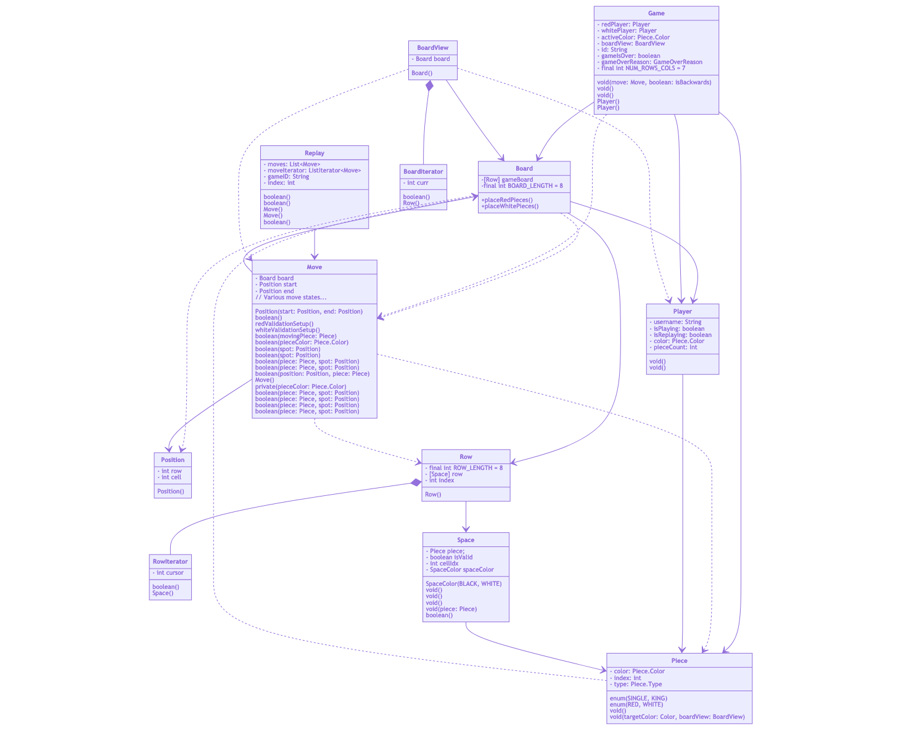
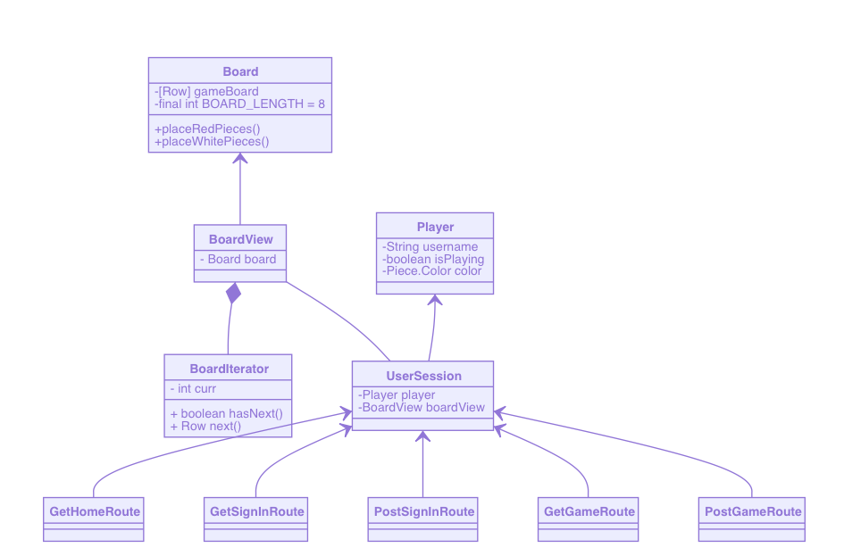

# WebCheckers Design Documentation
## Team Information
* Team name: Team C/Group Bee
* Team members
  * Peter Kos
  * Donald Craig
  * Danilo Sosa
  * Joseph Saltalamacchia
  * Elizabeth Sherrock

## Executive Summary

The WebCheckers application is an online version of the classic board game checkers. Users will be able to access the WebCheckers site and sign in with a username. At this point they can see any other players online and whether or not they are available to play. After selecting an available player both users will be put into a checkers game where they play by traditional American checkers rules. Game play ends when a player wins or when either one of the players chooses to resign. Each player is then brought back to the home page where they have the option to challenge another player or they can choose to sign out and leave the web application.

### Purpose
The aim of WebCheckers is to provide people a way to play a game of checkers online with other players from around the globe. The goal is to make this as easy to use and enjoyable as possible for anyone who likes to play checkers.

### Glossary and Acronyms
| Term |          Definition          |
|------|------------------------------|
| AI   | Artificial Intelligence      |
| CSS  | Cascading Style Sheets       |
| HTML | Hyper Text Markup Language   |
| HTTP | Hyper Text Transfer Protocol |
| MVP  | Minimum Viable Product       |
| OOP  | Object Oriented Programming  |
| POJO | Plain Old Java Objects       |
| UI   | User Interface               |
| VO   | Value Object                 |

|      Term     |                                       Definition                                      |
|---------------|---------------------------------------------------------------------------------------|
| debuggability | The act of writing code that is easy to debug.                                        |
| reflection    | Inspecting the fields of a class, particularly its private fields. Can be dangerous! |
| controller    | A class that serves as a "hub" of functionality for other features.                   |
| Spark         | Specifically Java Spark -- the main framework used to structure the project.          |
| FreeMarker    | The template engine used to render data onto the webpage from a controller.           |
| Session       | Stores data relevant to a specific user.                                              |


## Requirements

* Player must be able to sign in with a user name.
* The player must be able to sign out if they are signed in.
* Player must be able to challenge another player to a game.
* The Players must be able to play game of checkers online using American rules.
* Either player must be able to resign from a game during their turn if they so choose.
* The players are notified of the winner of the match and are able to exit the game and return to the home screen.

### Definition of MVP

The MVP for this project is a web-based checkers game. Users must be able to sign in using alphanumeric characters (possibly containing, but not composed entirely of, spaces), and said username must be unique. Players must also be able to sign out when not in a game.

When at least two players are signed in they must be able to start a game of checkers with each other. The game follows the standard American rules for checkers (located here: http://www.se.rit.edu/~swen-261/projects/WebCheckers/American%20Rules.html)

Either player must also be able to resign the game at any point, ending the game for both players.

### MVP Features
|       Story        |                                                                                          Summary                                                                                           |
|--------------------|--------------------------------------------------------------------------------------------------------------------------------------------------------------------------------------------|
| Sign-in            | A player must be able to sign in (with an alphanumeric username) and sign out when they like                                                                                               |
| Start a game       | A player who is sing in must be able to start a game with another player who is signed in and not currently in a game                                                                      |
| Change player turn | Only the turn player should be able to move pieces. After a move is made the turn player should switch                                                                                     |
| Move piece         | A piece should be able to move forward and diagonal one space, only landing on black spaces                                                                                                |
| Jump piece         | If the opposing player has a piece in a space that the turn player could normally move to the turn player must jump that piece, removing the opponent's piece from the board               |
| Multiple jumps     | If a piece jumped an opponent's piece, and there would be another jump move available, the player must make that jump move.                                                                |
| King piece         | If a piece makes it to the opposite side of the board from where it started then another piece of the same color should be placed on top of it, granting it the ability to move backwards. |
| Resign game        | A player should be able to resign at any point, ending the game and declaring the other player the winner                                                                                  |
| Game over          | Whenever a player runs out of pieces, resigns, or otherwise cannot make a move, the game ends and they are declared the loser

### Roadmap of Enhancements
|         Story           |                                                                                                                       intended Function                                                                                                              |                                                                                                                                                  Current State                                                                                                                                                      |                                                                                                                                                                        Of note                                                                                                                                                                  |
|-------------------------|------------------------------------------------------------------------------------------------------------------------------------------------------------------------------------------------------------------------------------------------------|---------------------------------------------------------------------------------------------------------------------------------------------------------------------------------------------------------------------------------------------------------------------------------------------------------------------|-------------------------------------------------------------------------------------------------------------------------------------------------------------------------------------------------------------------------------------------------------------------------------------------------------------------------------------------------|
| Replay Mode interface   | Once a user logs in they will be able to see a list of previously played games on the home screen, ordered by time finished. When one of these games are clicked on the user will be taken to a view of the beginning of that game in replay mode    | Past games appear as radio buttons on the home screen after a player has logged in. After one is selected and the "replay" button is pressed a replay will begin. While in a replay the user is removed from the list of active players on the home screen for other users, so others cannot start a game with them | Currently, for reasons unknown, if a game with an even number of turns is played it will not be saved as a replay nor be visible from the home screen. Additionally, there is a small chance that a given game will be overwritten by another one if a new game is finished at the exact same millisecond of another day                        |
| Next turn button        | While in a replay a user can click the "next" button, which will make the next move that was made in the game being watched. This button should be deactivated while on the last turn                                                                | Hitting the next button while in the replay will advance to the next move. If the user is already on the last turn this button is deactivated                                                                                                                                                                       | The page does not refresh automatically when viewing a replay, and must be done manually                                                                                                                                                                                                                                                        |                                                                                                                                           |
| Last turn button        | While in a replay a user can click the "previous" button to view the previous move made in the game. This button should be deactivated while on the first turn.                                                                                      | While in a replay the user can press the "previous" button to display the previous move made. This button is deactivated while on the first move                                                                                                                                                                    | Currently while backing up over a jump move the piece that is replaced (the one that was jumped) is set to white. Additionally, the previous button deactivates on the second move instead of the first. If the previous button is hit at this point, both the previous and next buttons are deactivated, forcing the player to exit the replay.|                                                                                                                                          |
| exit button             | While in a replay the user can click the exit button to return to the home page                                                                                                                                                                      | Any in a replay the user can click the exit button to exit the replay                                                                                                                                                                                                                                               |                                                                                                                                                                                                                                                                                                                                                 |


<div style="page-break-after: always;"></div>

## Application Domain


Web Checkers Domain Model

Our domain model details an over-arching idea of what our web-hosted checker's game would entail. It focuses on the player as the central point through which all things flow (as just like an actual game of checkers, if there is no player there is no game).

Noteably, individual rows and positions are not represented in the model as they can be inferred. Additionally, it is noted that games are saved directly to a playback feature which contains all previous games and can be accessed from the home screen.(Of note: each game played is stored once, this is not optional, and the playback stores all game that have been played on this server.)


<div style="page-break-after: always;"></div>

## Architecture and Design

### Summary

The following Tiers/Layers model shows a high-level view of the webapp's architecture.


Architecture Tiers and Layers

As a web application, the user interacts with the system using a
browser.  The client-side of the UI is composed of HTML pages with
some minimal CSS for styling the page.  There is also some JavaScript
that has been provided to the team by the architect.

The server-side tiers include the UI Tier that is composed of UI Controllers and Views.
Controllers are built using the Spark framework and View are built using the FreeMarker framework.  The Application and Model tiers are built using plain-old Java objects (POJOs).

Details of the components within these tiers are supplied below.

<div style="page-break-after: always;"></div>

### Overview of User Interface


Checkers State Diagram


The State Diagram gives a look at the overall user interface. This can be further broken down into sections giving a better view of the more distinct areas.

#### Starting the Game

Starting State Diagram


The path to sign in and start a game is detailed here.

#### Playing the Game

Play State Diagram


Turn by turn game play is shown in the above diagram.

#### End of Game

End Game State Diagram

Once a game is over both players will be sent back to the home page.

#### Replay Mode

Replay State Diagram


The replay mode enhancement makes for a nice addition to the game.

### UI Tier
These diagrams reveal a complicated structure with moderate coupling. Our controllers make heavy use of a _small_ subset of "abstraction" classes -- `BoardView`, `UserSession`, `PlayerLobby` are the strongest contenders. (Admittedly, `Player` could be factored out.)
Additionally, not shown here is the all-important `Constants` file, which almost every single class is coupled to. This is expected and encouraged in our design as it:
* Increases readability of commonly used strings,
* Removes ambiguity about where commonly used strings should go, and
* Takes advantage of functions to make "format" strings easy to read in any context via IDE-autocomplete.

The UI Tier can be broken down into 4 sub-sections:
* Sign In Routes
* Game Routes
* Turn Routes
* Replay Routes

#### Sign In Routes

 A notable exception of this is in the `GetGameRoute`.

Now, what are these operations?

First, the `Player` is grabbed from the UserSession. The `title` and `NumberOfUsers` is set for the view model, to be presented on the screen.

1. If the player is null, the default (blank) homepage is shown.
2. If not null, and the user is in a game, they will be redirected to `/game`.
3. If not null, and the user is not in a game, they will get a custom welcome message with their username, they will see a list of other signed in players, and (if there are any available) users will see a list of replays of all previous games played on the server in chronological order.

##### GetSignInRoute

Signing in is the next logical step for a new user. Or rather, the _only_ valid step.

It redirects to home (`/`) if the `UserSession` is not defined. Otherwise it shows the sign in screen.

##### PostSignInRoute

Now, once the user is signed in, the `PlayerLobby` checks if the username is valid.
> Valid usernames are usernames that contain at least one alphanumeric character, and is not already in use.

At this point, the username is valid. A `Player` is created, added to the session, and the user is redirected to home (`/`).

##### PostSignOutRoute

This class is the UI component to sign out from the game, via POST. The class will be called when the player has signed in and clicks the Sign Out in the navigation bar. If the player tries to do so during a game the page will only refresh since they are not allowed to sign out during a game, they will need to resign first in order to sign out. If the player is not in a game then he/she will be removed from the player lobby and the session will be removed as well. Finally, the user will be prompted to the Home Page with the navigation bar showing the option to Sign In.

#### Game Routes


Game Routes Diagram

##### GetGameRoute

This class is the UI controller to GET the game route. If the game is not over, the class will assign each user to either RedPlayer or WhitePlayer and set up the BoardView for them. They will be able to move pieces, backup a turn, and resign. If the game is over we will enable the Exit button and if they press it they will be redirected to the Home Page. We also show a message of how the game ended and finally save the game replay.

##### PostGameRoute

After the redirect to home, if there are other players online, they will be displayed to the user, who is able to select an opponent. The home page contains an HTML form which is used for the selection. Upon submission, the page submits a `POST` request which simultaneously redirects to `/startgame`.

`/startgame` is the middleman between the home page and the game page, checking that the conditions to start a game are met. The `POST` request contains the username of the desired opponent that was submitted via HTML form. The route takes that username and uses it to retrieve the `Player` from `PlayerLobby`. If the second player is `null`, the user is redirected to the home page. Currently players can only participate in one game at a time, so if the second player is already in a game, the user is also redirected to the home page, this time with an error message explaining that the desired player is already in a match. If neither of those conditions are satisfied, the first player (the user) is assigned red pieces, the second player is assigned white pieces, and after being marked as playing a game, both are redirected to `/game`.

##### PostResignGameRoute

This class is the UI component to resign the game, via POST. The class is called when the player clicks the Resign button within a game, keep in mind we show a message to confirm the player wants to resign. We use the `UserSession` to get the player that clicked the button and use its `userName` to get the game he is currently playing. Then we call the `playerResign()` method from the Game class and now the game's `gameIsOver` is set to true. We also change the player's `isPlaying` to false since the game ended. After the player resigns he will be prompted to the Home Page. For the other player the game view will update to notify him the game has ended and just show the Exit button so he/she can go back to the Home Page.

##### BoardView

This class interprets a checkers board for the view. The class will generate a board depending on the color of the player. If the player is red it will generate a board with red pieces on the bottom and if the player is white it will generate the same board mentioned before and then flip it so white pieces are now on the bottom.

#### Turn Routes


Turn Routes Diagram

##### PostValidateMoveRoute

This class is the UI component to check if a move is valid, via POST. We use the `actionData` which is the start coordinate and the end coordinate of the move, to create the start and end Positions. Then we use the `Usersession` to know the color of the player that is performing the move and create a `Move` with the start and end positions. We make sure that if the player already made a move within the turn, we check that the next move is a jump move. The `isValid()` methods are called no matter what type of move it is. If the moves are valid we update the view for both players after turn is submitted. If the moves are not valid an error message will be shown to the player performing the move.

##### PostSubmitTurnRoute

This class is the UI component to validate and submit an entire turn. Once a sequence of valid moves have been submitted and the user clicks the `validate Move` button this class will retrieve a list of all of the moves made that turn and ensure that they are all valid in a sequence. Most importantly this class ensures that if a jump move was made, and the piece that moved still have a jump move available, that the player will not actually be able to submit the turn, instead prompting them that there is still a jump move available. Otherwise, if the turn has been validated, this class will prompt the game to update the board and prompt the view to update the display for both players.

##### PostCheckTurnRoute

This class simply checks if it is the user's turn. If the user is the active player it informs the view that they are the active player, otherwise it will tell the view that they are not. This is used predominantly to ensure that a user cannot make a move if it is not their turn.

##### PostBackUpMoveRoute

This class is the UI component to undo a validated move, via POST. During a game if the players clicks the Backup button this class will be called. The class will us the `UserSession` which is the player that clicked the button and will call the `removeLastMove()` move. Now the view will show the piece in the position it was before the move.


#### Replay Routes


Replay Routes Diagram

##### GetReplayRoute

This class is the UI controller to GET the replay route. The class starts by setting the viewMode to Replay mode just like the GetGameRoute sets it to Play mode. Then we use the gameID to search for the game and get the game data such as the White and Red players. We also use the gameID to get the current replay the user is watching, now we have the list of moves from the game. Depending if there is a next or previous move the buttons will be enable. Also is worth mentioning that replays will only be available from the RedPlayer's perspective.

##### GetReplayExitRoute

This class is the UI Controller to GET the replay exit behavior. When the user exits the Replay mode this class is called. We change the user's status of `isReplaying` to false and redirect him/her to the Home Page.

##### PostReplayNextTurnRoute

This class is the UI Controller to POST the Replay next turn route. This class is called when the user clicks the Next button in the replay view. Within the class we use the gameID to get the current replay and then call the `getNextMove()` method from the replay. Then we get the game with the gameID and make the move we got from the method call.

##### PostReplayPreviousTurnRoute

This class is the UI Controller to POST the Replay previous turn route. This class is called when the user clicks the Previous button in the replay view. Within the class we use the gameID to get the current replay and then call the `getPreviousMove()` method from the replay. Then we get the game with the gameID and make the move we got from the method call.

### Application Tier
The Application Tier handles application-wide information that is important for both
the users and developers. These are the classes that make up the Application-Tier:

* GameCenter - Contains a HashMap of games in which the game Id is the key and the Game object is the value. With this class we can add new games as they start, get a game by searching for the Id and check if there are existing games. None of these data is pertinent to the user so it is not shown in the View.
* PlayerLobby - Contains a HashMap of players in which their username is the key and the Player object is the value. In this class we can add and remove players as they sign in and sign out. We can also get the complete list of players and the amount of players. We use a list of players without the current player to show what players are available to play. Finally, if a user enters WebCheckers without login we will only show the amount of players online.


### Model Tier
The Model Tier handles most of the application logic and consists of the following
classes that make up the major components of the WebCheckers application:

* Board – Consists of an array of Rows. Represents the board in our project, including all board-modifying options.
* BoardView - Serves as an abstraction for any views. Primary goal is to present a properly-oriented board for each player, such that their color is on the bottom of the screen.
* Game – Contains the game entity consisting of two players and the BoardView.
* Move – Defines a move in the game. This model takes care of ensuring a move is valid before it is accepted and the game board is updated.
* Piece – A checkers game piece, can be either Red or White.
* Player – The player entity that stores the unique username, player status and color.
* Position – Represents a location on the checkers board defined by the row and cell position on that row.
* Row – The game board consists of eight rows, each of which is an array of eight spaces.
* Space – Represents an individual location on a row. Each space keeps track of it’s color, whether or not a piece is on it and if it is a valid place for a move to be made.

 Models


### Design Improvements


#### Constants Refactoring
The first design improvement is ongoing, which is the **refactoring** of String constants into a singular file.
This is incredibly useful for two reasons: readability and testing.
In the original given code, we were expected to use `String.format` on existing format-specified Strings. Some of these were public, some were private. Some were used only in one file, while others were used widely. This was difficult to read, and made it hard to know when a String "belonged" to one class if multiple classes used the String equally.

We have since begun writing a `Constants` file that acts as a single source of truth for all String values in the project. This makes the code extremely easy to read (i.e., `Constants.userAlreadyInGameMessage`), and tests can access all of these values for assertions with a single `import`.

As the project progresses, we plan to factor out `enums` such as `Color` to this constants file, as well as other `Message`s and other single-use Strings.

#### Note on BoardView

Initially, in sprint 1, our `BoardView` class was improperly holding all of our model data. This required a deep refactor to separate our `Board` model data into its own `Board` class.

Additionally, this gave us the advantage of abstraction between our UI and Model tiers, which is clearly illustrated in the following diagram:

 BoardView

Here, **all** controllers are routed through `UserSession`, to `BoardView`, _before_ interacting with any models. This is an important separation of concerns and is a core part of our architecture -- as of Sprint 2, at least.


#### Refactoring

During our implementation, despite refactoring BoardView, many UI controllers still dipped down into the Board class to work properly. Also, many Model classes used the BoardView still, despite only needing its internal Board.

We fully refactored the BoardView out of the Model tier, and _some_ of the model was, in turn, decoupled from the controllers -- namely `PostValidateTurnRoute`. However, there still remains some logic that could be moved down into the Move class fairly easily in order to let Move be soely responsible for move validation. (The existing code in that controller serves to check multiple jump moves, in part.)

In addition, we also:

- cleared out copied+pasted comments that were incorrect from other controllers,
- cleaned up documentation inside all classes,
- removed unused variable names and method paramters, and
- converted dependencies to associations where appropriate.

## Testing


### Acceptance Testing
Both of the user stories completed in sprint 1 have passed all of their acceptance criteria. Currently twelve other stories have not had any testing yet, with half being in the sprint backlog and the other half in the product backlog.

We strove to maintain a strict style where people who wrote code for a card did not also test that card. This was easier in the beginning because we worked more synchronously, and it was easy to tell who had coded and not. However, as we all started to contribute to a single card, nobody was left who could test.

Instead, we let anyone test who wanted to. This made it easier for team members to contribute to each card rather than keep an entire card to themselves.

During acceptance testing of the player sign-in user story, there were certain points that failed in the first round of testing:

#### Start a Game

The only setback during the Start a Game testing was the view of the pieces in the board. At first the pieces didn't show at all in the board, but after fixing the `isValid()` method in the Space class pieces were now showing. However, they were not showing in the correct positions. Finally, we had to fix the logic in an `If` statement from the `Row` class in which the assigning of valid spaces depending of the index was wrong.

#### Sign in card

This card was also responsible for the removal of a procedure: to re-run through all acceptance criteria when a single one is invalid, to prevent regressions.

However the sign in card hit us with many, many bugs, up until thirty minutes before our initial demo. Enough **refactoring** led us to a working solution, but not without much confusion. We settled on making our unit tests more thorough since this card.


### Unit Testing and Code Coverage

 Unit testing

This figure is the code coverage report for our whole project. The only packages that we wrote unit tests for were `com.webcheckers.appl`, `com.webcheckers.model`, and `com.webcheckers.ui`. We did not write test suites for `global`, `util`, or the main `Application.java` located in `com.webcheckers`. There is signifigantly less coverage for code pertaining to the replay mode enhancement, partly due to the fact we prioritized developing the feature before testing. We would rather have a complete feature with no unit tests rather than a partially complete feature with full coverage of the incomplete code.

Our unit tests followed three main principles:
1) Be self-contained
2) Be thorough
3) Be descriptive

To be self-contained, we tried to rely as little as possible on other tests, or other classes, creating mocks where needed. The only exception to this was getter methods.

> We assume that getter methods are fully functional to avoid a need to use reflection, which is error-prone at best and mysterious at worst.

In descriptiveness, we sought to make our method names as verbose as possible.

For example, in `PostSignInRoute`:
````java
public void testUserNameIsValid() { ... }
````
versus
````java
public void testWhenUsernameHasNoAlphanumericCharactersShowInvalidMessage() { ... }
````

This is due to the principle of **debugability**.

If someone broke some code, the error message is the test name itself, as then the programmer doesn't have to debug the test.
In this case, if the above test did not work, the user would know that the single use case of a username with _no_ alphanumeric characters would _not_ be showing an invalid message, when it should.

Two paths of logic are immediately available:
1. The username with _no_ alphanumeric characters is broken somehow
2. The invalid message is not set properly in code

If we peek into the component test code, we can see this logic represented _directly_ in the source:

`PostSignInRoute.java`
````java
// Check if the username is valid: that is,
// a username that contains at least one alphanumeric character,
// and is NOT already in use.
// If not valid, show an error to the user.
if (!playerLobby.isValidUsername(username)) {
    // ...
    viewModel.put("message", Constants.invalidUsernameMessage);
    return templateEngine.render(new ModelAndView(viewModel, "signin.ftl"));
}
````

This direct mapping between test architecture and code structure is a key element of our test design.

 Unit Testing - Application Tier

The code coverage report for application tier classes. As evidenced by the 0% coverage for `ReplayList`, there were no unit tests written for this class. This is a consequence of the aforementioned choice to prioritize enhancement functionality over coverage in the time crunch.
 Unit Testing - UI Tier

One thing to note in this report of coverage for the UI tier, is that `WebServer` was intentionally not tested. This was a supplied file, which we only changed to add route mapping.
 Unit Testing - Model Tier

In this model tier coverage report, the lack of coverage can be attributed to two things: Not testing getter methods, and not having the time to properly write tests for all of the classes. Even the classes which we completed unit tests for does not have 100% coverage since we did not write code that only tested getter methods (a choice which is explained earlier in this section).
